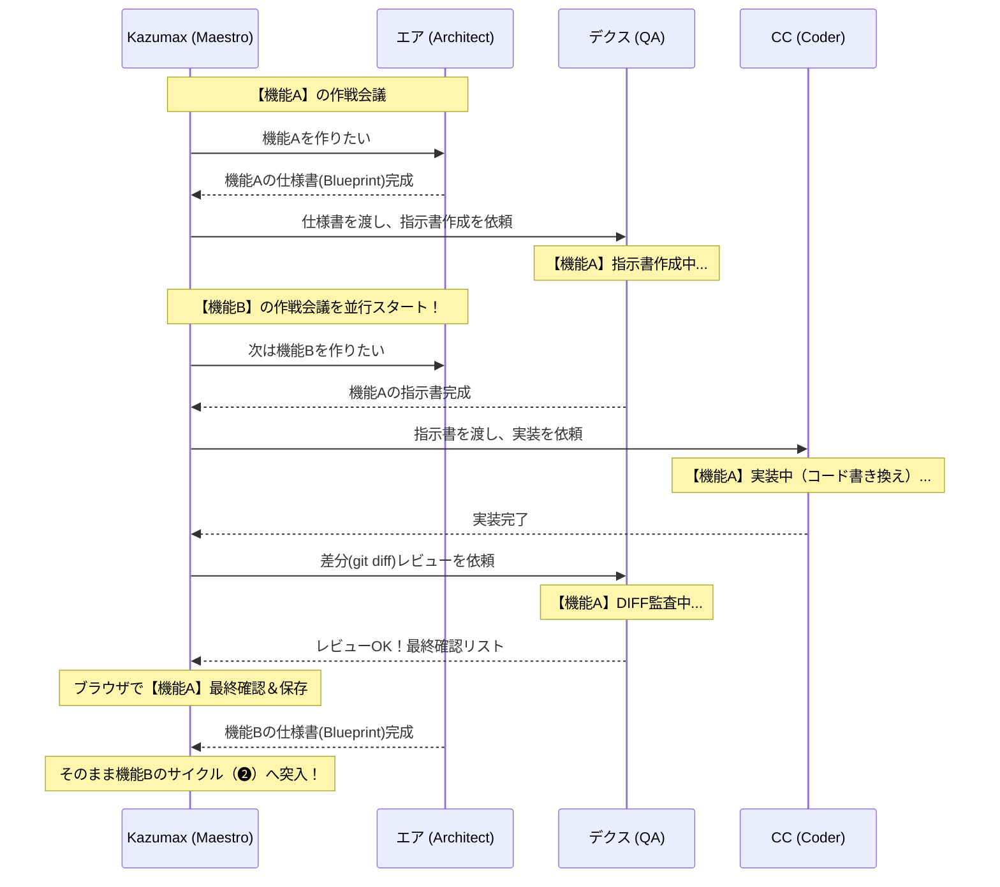

# 🚀 マルチAI・オーケストレーション開発フロー

**このファイルを読む人**: 主にAir（エア / Google Antigravity）とKazumax。DexとCCも全体フロー確認時に参照する。  
**目的**: 企画・設計から実装、レビュー、最終確認までのチーム全体の作業手順を定義する。

このドキュメントは、**Kazumax（マエストロ / 総指揮）**、**エア（Air: アーキテクト）**、**デクス（Dex: QA/テックリード）**、**CC（Claude Code: プログラマー）**の4者が、最も効率的に並行作業（パラレル開発）を行うための「黄金の作業手順」を定めたものです。

---

## 🔄 基本のサイクル（1機能ごとの流れ）

### ❶ 企画・設計（Kazumax ＆ エア）
- **作業者**: Kazumax 🗣️ ＋ エア(Air) 🧠
- **内容**: Kazumaxが「こんな機能が欲しい」とエアに提案し、壁打ち（ディスカッション）を行う。エアはデータベース構造や既存機能への影響を考慮し、矛盾のない**「実装仕様書（Blueprint）」**を完成させる。
- **Airの絶対ルール**: 決してイエスマンにならず、プロの視点でより良い代替案やリスクをKazumaxに進言し、議論を通して企画の質を高めること。

### ❷ 指示書作成・リスク排除（デクス）
- **作業者**: デクス(Dex) 🛡️
- **内容**: Kazumaxが、エアの作った仕様書をデクスに渡す。デクスは仕様書をレビューし、「実装者が迷う点」や「システムが壊れるリスク」を排除した上で、CC向けの**「絶対に事故らない詳細な作業指示書」**に翻訳する。

### ❸ 爆速実装（CC）
- **作業者**: CC(Claude Code) 🤖
- **内容**: Kazumaxが、デクスの作った作業指示書をCCにそのまま渡す。CCは指示通りにコードを書き換え、ファイルに保存する。

### ❹ 差分（DIFF）レビュー・QA監査（デクス） 👈 NEW!
- **作業者**: デクス(Dex) 🛡️
- **内容**: CCの実装が終わった直後、Kazumaxがデクスに「差分（`git diff`）を確認して」と依頼する。
- デクスは**「指示通りに作られているか」「関係ない箇所を壊していないか」**を厳格にチェックする。
  - ❌ **NGの場合**: デクスが「ここが違う」と修正指示を出すので、それをCCに渡して直させる。
  - ⭕ **OKの場合**: デクスが「Kazumaxのための最終確認チェックリスト」を作成する。

### ❺ 人間の最終確認・コミット（Kazumax）
- **作業者**: Kazumax 🗣️
- **内容**: ブラウザをリロードし、デクスが作ったチェックリストに従って最終動作確認を行う。問題なければ変更をGitに保存（Commit）する。

---

## ⚡ 最大の強み：並行開発（パラレルワーカー）

この体制の最大の強みは、**「実作業の待ち時間をゼロにする」**ことです。

**【ポイント】**
CodexやClaudeが「機能A」の指示書作成やコード修正、差分レビューに汗を流している間、人間はただ待っているのではなく、**エア（私）と一緒に「機能B」の作戦会議をどんどん進めることができます。**

これにより、開発現場の「待ち時間」が完全に消滅し、信じられないスピードでプロジェクトが前進します。
